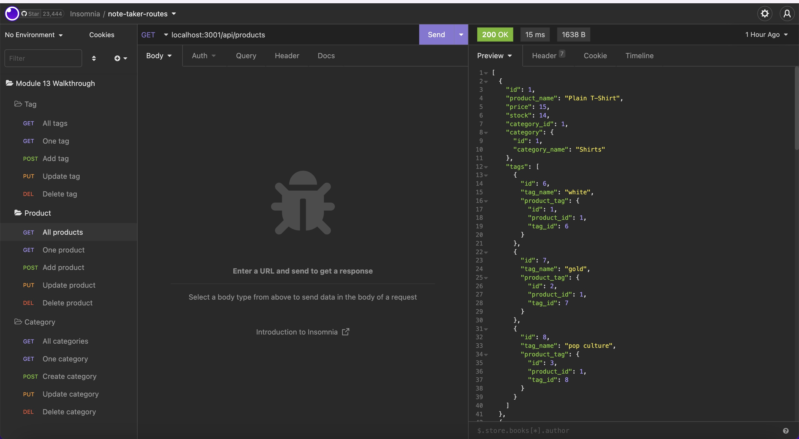
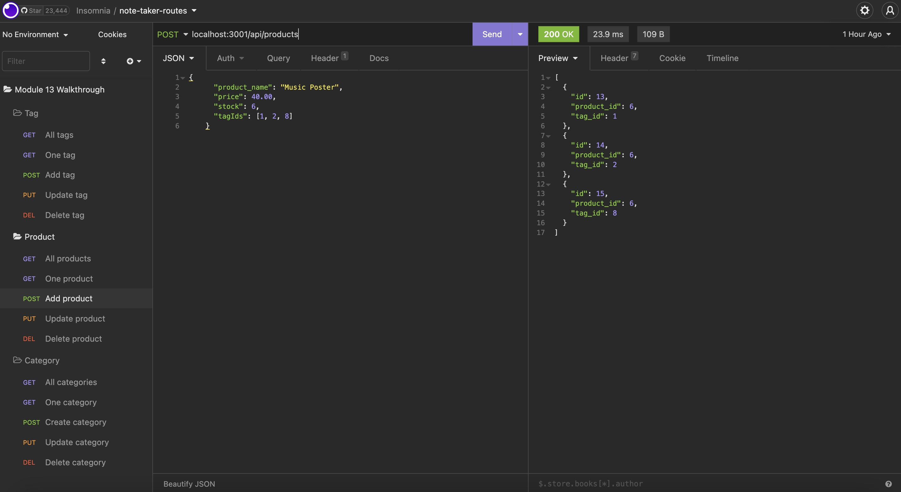
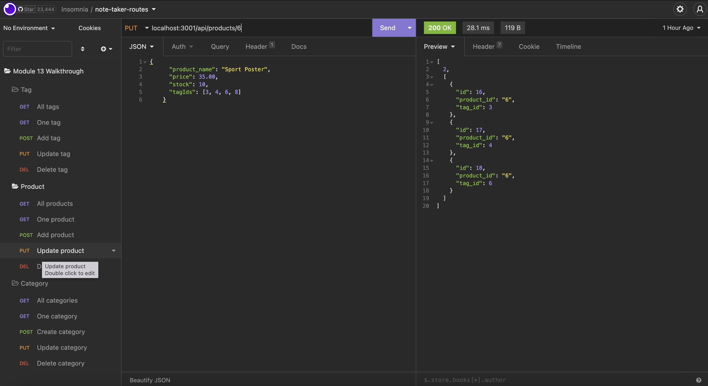
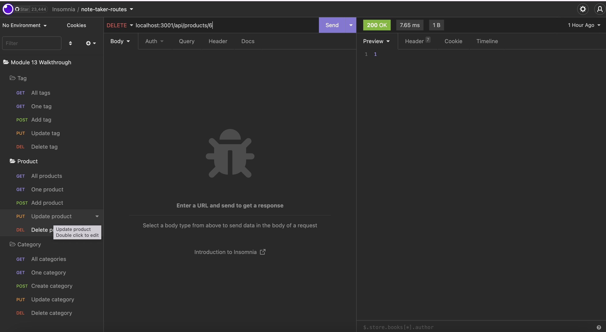

# ORM Back End for E-commerce: ORM-retail-ecommerce

Module 13 - Object-Relational Mapping (ORM) Challenge: E-commerce Back End

---

## Description

ORM-retail-ecommerce is back end code with the purpose of managing and creating the back end of an E-commerce website using a MySQL database. This project required Express.js API to be configured to use Sequelize in order to interact with the database. Multiple route handlers were created to perform various tasks to access, create, update, and delete data that specifically relates to E-commerce. Currently there is seeded data to function as an example of the type of data that could be stored in the database.

### Skills Learned/ Improved

Here is a list of some skills I learned and/or improved throughout this project:

- Organizing files in specific directories that align with the industry standard.
- Using Sequelize to do database (db) queries with MySQL.
- Increased familiarity with the syntax for sequelize db queries to get/update/remove necessary data.
- Using express to create routes with various functions
  - GET, POST, PUT, DELETE

Tools used to complete this project:

- VS Code
- Terminal
- GitHub
- Node.js
- MySQL
- Express.js
- Sequelize

## Installation

To install the application:

1. Open the GitHub repository.
2. Click the code dropdown button, select the preferred cloning method, and clone code to device.
3. Open the cloned code in preferred code editor.
4. Install Node.js packages.
5. Launch MySQL in terminal, then run schema and seed commands.
   - `mysql -u root -p` then enter MySQL password.
   - `\. schema.sql` to create the database.
   - `quit` to close MySQL.
   - `npm run seed` to seed data.
6. Run `npm start` to start the server.
7. Use localhost http in browser OR preferred API testing tool.

## Usage

This code is meant to be used for an E-commerce website as the back end to create, manage, and maintain data within a MySQL database. This provides various routes to access the data, along with the ability to create, update, and delete data. Since this is the back end for a E-commerce website, there is no deployed version.

Some of the data able to be accessed and manipulated:

- All products, categories, and tags, in addition to accessing a specific one based on id.
- Create products, categories, and tags.
- Update specific products, categories, and tags based on id.
- Delete specific products, categories, and tags based on id.

Using insomnia to test all routes:

### Links

There is no deployed version of this application, but there is a walk through video demonstrating the functionality.

[Link](https://drive.google.com/file/d/1jOjeiGI9H8cFGXXTHykCD2mNMuJ7spsW/view) to walk through video.

[Link](https://github.com/alverson98/ORM-retail-ecommerce) to code repository.

## Questions

You may contact me with any questions or concerns through the email provided or my GitHub.

Email: alverson98@yahoo.com

GitHub: https://github.com/alverson98

## Credits

I received guidance and tips from the instructional staff, TA's, and Students from the University of Denver Coding Boot Camp.
